# Architecture: Smart Emergency Blood Network (SEBN)

This document describes the system architecture of SEBN, explaining how the platform is structured internally to support governed organization management and emergency blood coordination.

The architecture is intentionally designed to be simple, modular, and scalable, aligning with real-world healthcare and institutional systems.

## 1. Architecture Overview

SEBN follows a centralized backend architecture with modular separation, combined with a role-based frontend structure.

- A single backend API handles all business logic
- Clear separation of concerns using controllers, routes, and models
- Frontend is organized by user roles and organizations
- Governance is enforced centrally through authentication, authorization, and audit layers

This design ensures control, traceability, and ease of extension without unnecessary complexity.

### High-Level 3-Tier Architecture

## 2. Architecture Style

### Backend

- Monolithic backend with modular design
- Built using Node.js and Express.js
- Modules separated logically by domain (admin, organization, NGO, donor, auth)

**Why this approach was chosen:**

- Easier to reason about during early stages
- Lower operational complexity
- Suitable for controlled, rule-driven systems
- Can be modularized further if scale increases

### Frontend

- Single-page application (SPA) using React
- Role-based layouts and routing
- Clear separation between Super Admin, Hospital, Blood Bank, and NGO interfaces

### Backend Module Organization

```mermaid
%%{init: {'flowchart': {'nodeSpacing': 120, 'rankSpacing': 150, 'padding': '120', 'htmlLabels': true, 'curve': 'linear', 'diagramMarginX': 150, 'diagramMarginY': 150}, 'fontSize': 26, 'fontFamily': 'Arial'}}%%
graph LR
    Root["<b style='font-size:40px; padding: 20px;'>🏗️ SEBN BACKEND<br/>Node.js + Express</b>"]
    
    subgraph Routes["<b style='font-size:32px'>📁 ROUTES<br/>API Endpoints</b>"]
        R1["<b style='font-size:24px; padding: 15px;'>admin.js</b>"]
        R2["<b style='font-size:24px; padding: 15px;'>auth.js</b>"]
        R3["<b style='font-size:24px; padding: 15px;'>organization.js</b>"]
        R4["<b style='font-size:24px; padding: 15px;'>bloodstock.js</b>"]
        R5["<b style='font-size:24px; padding: 15px;'>requests.js</b>"]
        R6["<b style='font-size:24px; padding: 15px;'>ngo.js</b>"]
        R7["<b style='font-size:24px; padding: 15px;'>donor.js</b>"]
    end
    
    subgraph Controllers["<b style='font-size:32px'>⚙️ CONTROLLERS<br/>Business Logic</b>"]
        C1["<b style='font-size:24px; padding: 15px;'>adminController</b>"]
        C2["<b style='font-size:24px; padding: 15px;'>authController</b>"]
        C3["<b style='font-size:24px; padding: 15px;'>organizationController</b>"]
        C4["<b style='font-size:24px; padding: 15px;'>requestController</b>"]
        C5["<b style='font-size:24px; padding: 15px;'>donorController</b>"]
        C6["<b style='font-size:24px; padding: 15px;'>searchController</b>"]
    end
    
    subgraph Models["<b style='font-size:32px'>💾 MODELS<br/>Data Structures</b>"]
        M1["<b style='font-size:24px; padding: 15px;'>Admin</b>"]
        M2["<b style='font-size:24px; padding: 15px;'>Organization</b>"]
        M3["<b style='font-size:24px; padding: 15px;'>BloodStock</b>"]
        M4["<b style='font-size:24px; padding: 15px;'>Request</b>"]
        M5["<b style='font-size:24px; padding: 15px;'>Donor</b>"]
        M6["<b style='font-size:24px; padding: 15px;'>AuditLog</b>"]
    end
    
    subgraph Middleware["<b style='font-size:32px'>🔐 MIDDLEWARE<br/>Auth & Guards</b>"]
        MW1["<b style='font-size:24px; padding: 15px;'>authMiddleware</b>"]
        MW2["<b style='font-size:24px; padding: 15px;'>roleMiddleware</b>"]
        MW3["<b style='font-size:24px; padding: 15px;'>rateLimiter</b>"]
        MW4["<b style='font-size:24px; padding: 15px;'>errorHandler</b>"]
    end
    
    subgraph Utils["<b style='font-size:32px'>🛠️ UTILS<br/>Helpers & Tools</b>"]
        U1["<b style='font-size:24px; padding: 15px;'>Validators</b>"]
        U2["<b style='font-size:24px; padding: 15px;'>Handlers</b>"]
        U3["<b style='font-size:24px; padding: 15px;'>Constants</b>"]
    end
    
    subgraph Config["<b style='font-size:32px'>⚡ CONFIG<br/>Setup</b>"]
        CF1["<b style='font-size:24px; padding: 15px;'>Database</b>"]
        CF2["<b style='font-size:24px; padding: 15px;'>Environment</b>"]
    end
    
    Root --> Routes
    Root --> Controllers
    Root --> Models
    Root --> Middleware
    Root --> Utils
    Root --> Config
    
    style Root fill:#1a0f2e,stroke:#000,stroke-width:4px,color:#fff
    style Routes fill:#5e35b1,stroke:#4527a0,stroke-width:3px,color:#fff
    style Controllers fill:#b71c1c,stroke:#8b0000,stroke-width:3px,color:#fff
    style Models fill:#0d47a1,stroke:#0a3d91,stroke-width:3px,color:#fff
    style Middleware fill:#004d40,stroke:#00332e,stroke-width:3px,color:#fff
    style Utils fill:#e65100,stroke:#c41c00,stroke-width:3px,color:#fff
    style Config fill:#1b5e20,stroke:#003300,stroke-width:3px,color:#fff
    style R1 fill:#7b1fa2,stroke:#6a0dad,stroke-width:2px,color:#fff
    style R2 fill:#7b1fa2,stroke:#6a0dad,stroke-width:2px,color:#fff
    style R3 fill:#7b1fa2,stroke:#6a0dad,stroke-width:2px,color:#fff
    style R4 fill:#7b1fa2,stroke:#6a0dad,stroke-width:2px,color:#fff
    style R5 fill:#7b1fa2,stroke:#6a0dad,stroke-width:2px,color:#fff
    style R6 fill:#7b1fa2,stroke:#6a0dad,stroke-width:2px,color:#fff
    style R7 fill:#7b1fa2,stroke:#6a0dad,stroke-width:2px,color:#fff
    style C1 fill:#c62828,stroke:#ad1457,stroke-width:2px,color:#fff
    style C2 fill:#c62828,stroke:#ad1457,stroke-width:2px,color:#fff
    style C3 fill:#c62828,stroke:#ad1457,stroke-width:2px,color:#fff
    style C4 fill:#c62828,stroke:#ad1457,stroke-width:2px,color:#fff
    style C5 fill:#c62828,stroke:#ad1457,stroke-width:2px,color:#fff
    style C6 fill:#c62828,stroke:#ad1457,stroke-width:2px,color:#fff
    style M1 fill:#1565c0,stroke:#0d47a1,stroke-width:2px,color:#fff
    style M2 fill:#1565c0,stroke:#0d47a1,stroke-width:2px,color:#fff
    style M3 fill:#1565c0,stroke:#0d47a1,stroke-width:2px,color:#fff
    style M4 fill:#1565c0,stroke:#0d47a1,stroke-width:2px,color:#fff
    style M5 fill:#1565c0,stroke:#0d47a1,stroke-width:2px,color:#fff
    style M6 fill:#1565c0,stroke:#0d47a1,stroke-width:2px,color:#fff
    style MW1 fill:#00695c,stroke:#004d40,stroke-width:2px,color:#fff
    style MW2 fill:#00695c,stroke:#004d40,stroke-width:2px,color:#fff
    style MW3 fill:#00695c,stroke:#004d40,stroke-width:2px,color:#fff
    style MW4 fill:#00695c,stroke:#004d40,stroke-width:2px,color:#fff
    style U1 fill:#d84315,stroke:#bf360c,stroke-width:2px,color:#fff
    style U2 fill:#d84315,stroke:#bf360c,stroke-width:2px,color:#fff
    style U3 fill:#d84315,stroke:#bf360c,stroke-width:2px,color:#fff
    style CF1 fill:#2e7d32,stroke:#1b5e20,stroke-width:2px,color:#fff
    style CF2 fill:#2e7d32,stroke:#1b5e20,stroke-width:2px,color:#fff
```

## 3. High-Level System Components

### Frontend Layer
- Handles user interaction and role-based dashboards
- Communicates with backend via REST APIs
- Enforces route protection using authentication context and guards

### Backend API Layer
- Central decision-making and coordination engine
- Applies business rules, validation, and governance
- Exposes APIs for frontend consumption

### Data Layer
- Centralized MongoDB database
- Stores organizations, users, blood stock, requests, and audit logs

## 4. Backend Architecture Breakdown

The backend follows a Controller–Route–Model pattern.

### Core Folders and Responsibilities

**routes/**
- Defines API endpoints
- Segregated by domain (admin, auth, organization, donor, NGO)
- Applies authentication and role-based middleware

**controllers/**
- Contains business logic
- Handles request validation, processing, and responses
- Admin controllers manage governance-related operations
- Organization controllers handle operational workflows

**models/**
- Defines data structures and persistence logic
- Organized by domain (admin, organization, NGO, donor)
- Designed to support auditability and traceability

**middleware/**
- Authentication and authorization enforcement
- Role validation (Super Admin, Org Admin, Staff)
- Rate limiting and security controls

**config/**
- Database configuration and environment setup

**utils/**
- Shared helpers (validators, response handlers, constants, code generators)

### Request Processing Flow (with RBAC)

```mermaid
sequenceDiagram
    participant Client as Frontend<br/>React
    participant API as Express<br/>API Layer
    participant Auth as Auth<br/>Middleware
    participant RBAC as Role<br/>Middleware
    participant Controller as Controller<br/>Business Logic
    participant DB as MongoDB<br/>Database
    
    Client->>API: HTTP Request + Token
    API->>Auth: Validate Token
    Auth-->>API: ✓ User Authenticated
    API->>RBAC: Check User Role
    RBAC-->>API: ✓ Permission Allowed
    API->>Controller: Execute Business Logic
    Controller->>DB: Query/Update Data
    DB-->>Controller: Data Result
    Controller-->>API: Response
    API-->>Client: JSON Response
    
    Note over Auth,RBAC: Security Gates
    Note over Controller,DB: Business Logic
```

## 5. Role-Based Access Control (RBAC)

SEBN uses centralized RBAC enforced at the backend.

### Role Hierarchy & Access Model

```mermaid
graph TD
    SuperAdmin["👑 SUPER ADMIN<br/>Platform Level"]
    OrgAdmin["👨‍💼 ORG ADMIN<br/>Organization Level"]
    Staff["👤 STAFF<br/>Operational Level"]
    
    SuperAdmin -->|Controls| OrgAdmin
    SuperAdmin -->|Manages| Platform["✅ Approve Organizations<br/>✅ Monitor Audit Logs<br/>✅ System Settings<br/>✅ Alert Management"]
    
    OrgAdmin -->|Manages| Staff
    OrgAdmin -->|Controls| Org["✅ Manage Staff Users<br/>✅ Organization Data<br/>✅ Requests (Hospital)<br/>✅ Stock (Blood Bank)<br/>✅ Camps (NGO)"]
    
    Staff -->|Limited to| Operations["✅ Create Requests<br/>✅ Update Stock<br/>✅ Register Donors<br/>✅ View Org Data"]
    
    Middleware["RBAC Middleware<br/>Validates at Every API Call"] -.->|Enforces| SuperAdmin
    Middleware -.->|Enforces| OrgAdmin
    Middleware -.->|Enforces| Staff
    
    style SuperAdmin fill:#c62828,stroke:#b71c1c,stroke-width:2px,color:#fff
    style OrgAdmin fill:#e65100,stroke:#bf360c,stroke-width:2px,color:#fff
    style Staff fill:#1976d2,stroke:#0d47a1,stroke-width:2px,color:#fff
    style Middleware fill:#00897b,stroke:#00695c,stroke-width:2px,color:#fff
    style Platform fill:#fbc02d,stroke:#f57f17,stroke-width:2px,color:#000
    style Org fill:#fbc02d,stroke:#f57f17,stroke-width:2px,color:#000
    style Operations fill:#66bb6a,stroke:#2e7d32,stroke-width:2px,color:#fff
```

### Role Levels

**Super Admin**
- Platform-wide access
- Organization approval
- Audit and monitoring

**Organization Admin**
- Controls a single organization
- Manages staff users
- Oversees organization-level data

**Organization Staff**
- Performs operational tasks
- Limited to assigned organization scope

### Enforcement Strategy

- Role validation is applied using middleware
- Permissions are checked before controller execution
- Frontend routes are protected using ProtectedRoute and auth context

## 6. Frontend Architecture Design

The frontend is structured by responsibility and role, not just by UI components.

### Role-Based Frontend Structure

### Key Design Elements

**Layouts define role-specific dashboards**
- SuperAdminLayout
- HospitalLayout
- BloodBankLayout
- NgoLayout

**Pages are grouped by role**
- pages/superadmin
- pages/hospital
- pages/bloodbank
- pages/ngo

**Context-based authentication**
- Central AuthContext manages user session and role
- Route access is controlled consistently

**Service layer**
- API communication is abstracted into service files
- Keeps UI logic separate from API handling

## 7. Data Management Strategy

Single centralized MongoDB database with logical separation using collections.

Data access controlled strictly via backend:
- No direct client-side database interaction

### Data Flow Architecture

**This ensures:**
- Consistency
- Security
- Easier auditing
- Simplified maintenance

## 8. Governance & Audit Design

Governance is a core architectural concern, not an add-on.

- Organization onboarding is centrally approved
- All critical actions are logged
- Admin audit controllers provide visibility
- Rate limiting and validation reduce misuse

### Governance & Audit Flow

This architecture supports trust and accountability, which are critical in healthcare-related systems.

## 9. Scalability & Future Readiness

The architecture allows future growth without redesign:

- New roles or organizations can be added
- Additional emergency resources can be integrated
- Backend modules can be split if needed
- Frontend layouts support feature expansion

The current design prioritizes clarity and correctness over premature optimization.

### Scalability Path

## 10. Architecture at a Glance

## 11. Summary

SEBN's architecture is designed to be:

- ✅ **Governed and controlled** - Super Admin centralized oversight
- ✅ **Modular yet simple** - Clear separation of concerns
- ✅ **Real-world feasible** - Healthcare-aligned design
- ✅ **Easy to understand and extend** - Well-documented structure
- ✅ **Secure by design** - RBAC at every layer
- ✅ **Auditable** - Complete action tracking

By using a centralized backend with role-based frontend separation, the system effectively supports emergency coordination while maintaining trust, auditability, and operational clarity.