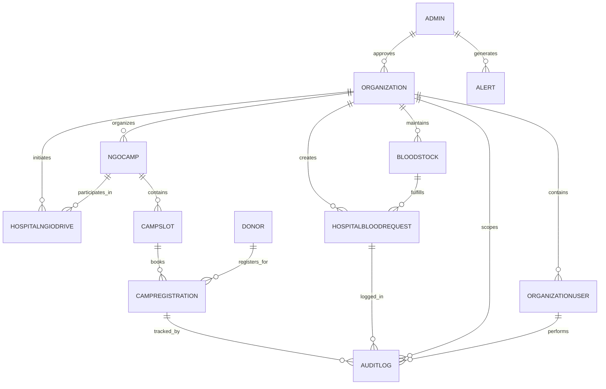

# Data Model: Smart Emergency Blood Network (SEBN)

This document describes the core data entities used in SEBN and how they relate to each other.
The data model is designed to support governance, traceability, and emergency blood coordination while remaining realistic and implementation-feasible.

---

## Entity-Relationship Diagram (Complete System)



---

## 1. Data Model Design Principles

SEBN's data model is based on the following principles:

- **Centralized Governance**: Super Admin controls all approvals and access
- **Organization-Scoped Isolation**: Each organization owns its data
- **Clear Separation of Concerns**: Operations, governance, and oversight are distinct
- **Complete Auditability**: Every critical action is logged and traceable
- **Minimal Data Collection**: Only essential fields are stored for efficiency

---

## 2. Core Entity Groups Overview

| Group | Entities | Purpose |
|-------|----------|---------|
| **Governance & System** | Admin, Alert | Platform oversight and notifications |
| **Organization & Users** | Organization, OrganizationUser | Multi-tenant architecture with role-based access |
| **Emergency Operations** | HospitalBloodRequest, BloodStock | Core emergency blood coordination |
| **NGO & Donors** | Donor, NgoCamp, CampSlot, CampRegistration, HospitalNgoDrive | Secondary support network and donor management |
| **Audit & Compliance** | AuditLog | Complete system accountability |

---

## 3. Governance & System Entities

### Admin (Super Admin)

**Purpose**: Represents platform-level administrators with system oversight capabilities.

**Attributes**:
| Field | Type | Description |
|-------|------|-------------|
| adminId | UUID (PK) | Unique admin identifier |
| adminCode | String | Unique Code identifier |
| name | String | Admin full name |
| email | String | Email address (unique) |
| role | Enum | Always SUPER_ADMIN |
| password | String | Hashed password |
| status | Enum | ACTIVE / INACTIVE |
| createdAt | Timestamp | Account creation time |
| updatedAt | Timestamp | Last update time |

**Relationships**:
- Approves ← Organization
- Generates → Alert

**Capabilities**:
- ✅ Approve/Reject organization registrations
- ✅ Monitor system activity and alerts
- ✅ Enforce governance rules
- ✅ View audit logs and reports

---

### Alert

**Purpose**: Represents system-generated and admin-generated alerts for critical events.

**Attributes**:
| Field | Type | Description |
|-------|------|-------------|
| alertId | UUID (PK) | Unique alert identifier |
| type | Enum | DELAYED_EMERGENCY / STOCK_CRITICAL / ORG_PENDING / SYSTEM_ERROR |
| title | String | Alert title/summary |
| message | String | Detailed alert message |
| severity | Enum | INFO / WARNING / CRITICAL |
| relatedEntityType | String | Entity this alert relates to (e.g., "HospitalBloodRequest") |
| relatedEntityId | UUID (FK) | ID of the related entity |
| isRead | Boolean | Read status |
| createdBy | String | SYSTEM / admin ID |
| status | Enum | UNRESOLVED / ACKNOWLEDGED / RESOLVED |
| createdAt | Timestamp | Alert creation time |
| readAt | Timestamp | When admin read the alert |

**Relationships**:
- Generated By ← Admin
- References → Organization/Request entities

**Trigger Examples**:
- Emergency request unmet after 1 hour
- Blood stock falls below critical threshold
- New organization awaiting approval
- System errors or anomalies

---

## 4. Organization & User Entities

### Organization

**Purpose**: Core multi-tenant entity representing any registered institution (Hospital, Blood Bank, or NGO).

**Attributes**:
| Field | Type | Description |
|-------|------|-------------|
| organizationId | UUID (PK) | Unique org identifier |
| organizationCode | String | Unique short code (e.g., "HOSP001") |
| name | String | Official organization name |
| type | Enum | HOSPITAL / BLOOD_BANK / NGO |
| address | String | Physical address |
| city | String | City name |
| state | String | State/Region |
| pinCode | String | Postal code |
| phoneNumber | String | Contact phone |
| emailAddress | String | Contact email |
| licenseNumber | String | License ID (hospital/blood bank) |
| registrationNumber | String | Registration number (NGO) |
| status | Enum | PENDING / APPROVED / SUSPENDED / REJECTED |
| organizationAdmin | Object | Admin user details (embedded) |
| approvedAt | Timestamp | Approval timestamp by Super Admin |
| suspendedAt | Timestamp | Suspension timestamp (if applicable) |
| createdAt | Timestamp | Registration timestamp |
| updatedAt | Timestamp | Last update timestamp |

**Relationships**:
- Approved By → Admin
- Contains ← OrganizationUser
- Maintains → BloodStock (if Blood Bank)
- Creates → HospitalBloodRequest (if Hospital)
- Organizes → NgoCamp (if NGO)

**Access Control**:
- Organization Admin manages all org users and operations
- Staff users operate under admin supervision
- All data scoped to organization

---

### OrganizationUser

**Purpose**: Represents users belonging to organizations with role-based access control.

**Attributes**:
| Field | Type | Description |
|-------|------|-------------|
| userId | UUID (PK) | Unique user identifier |
| organizationId | UUID (FK) | Parent organization |
| organizationCode | String | Short org code |
| organizationName | String | Org name (denormalized) |
| userCode | String | Unique user code within org (e.g., "USR001") |
| name | String | User full name |
| email | String | Email address (unique per org) |
| phoneNumber | String | Contact number |
| role | Enum | ADMIN / DOCTOR / STAFF (varies by org type) |
| status | Enum | ACTIVE / INACTIVE / SUSPENDED |
| lastLoginAt | Timestamp | Last login time |
| createdAt | Timestamp | Account creation time |
| updatedAt | Timestamp | Last update time |

**Relationships**:
- Belongs To → Organization
- Performs → AuditLog entries

**Role Permissions**:
- **ADMIN**: Full org control, approve requests, manage users
- **DOCTOR**: View/create requests (hospitals), approve camps (NGOs)
- **STAFF**: Perform day-to-day operations (update stock, register donors)

---

## 5. Emergency & Blood Stock Entities

### BloodStock

**Purpose**: Tracks blood availability at Blood Banks in real-time for emergency queries.

**Attributes**:
| Field | Type | Description |
|-------|------|-------------|
| stockId | UUID (PK) | Unique stock record identifier |
| bloodBankId | UUID (FK) | Parent blood bank organization |
| bloodBankCode | String | Blood bank code |
| bloodGroup | Enum | A+ / A- / B+ / B- / O+ / O- / AB+ / AB- |
| component | String | RBC / Plasma / Platelets / WBC / Whole Blood |
| unitsAvailable | Integer | Count of available units |
| unitsReserved | Integer | Count reserved for pending requests |
| criticalThreshold | Integer | Minimum units before alert |
| expiryDate | Date | When blood expires |
| lastStockUpdateAt | Timestamp | Last update by Blood Bank staff |
| updatedBy | UUID (FK) | User ID who updated the stock |
| createdAt | Timestamp | Stock record creation time |
| updatedAt | Timestamp | Last modification time |

**Relationships**:
- Maintained By → Organization (Blood Bank)
- Fulfills → HospitalBloodRequest
- Logged In → AuditLog

**Query Patterns**:
- Search by blood group and location radius
- Filter by availability (units > 0)
- Sort by proximity and urgency
- Trigger alerts if units < criticalThreshold

---

### HospitalBloodRequest

**Purpose**: Core entity driving the emergency blood request workflow and lifecycle tracking.

**Attributes**:
| Field | Type | Description |
|-------|------|-------------|
| requestId | UUID (PK) | Unique request identifier |
| hospitalId | UUID (FK) | Hospital organization |
| hospitalCode | String | Hospital code |
| bloodGroup | Enum | Requested blood group |
| component | String | Blood component needed |
| unitsRequired | Integer | Number of units needed |
| urgency | Enum | ROUTINE / URGENT / EMERGENCY (life-threatening) |
| priority | Enum | LOW / MEDIUM / HIGH |
| medicalNotes | String | Clinical notes/reason |
| patientName | String | Patient name |
| doctorName | String | Doctor's name |
| requestedBy | UUID (FK) | User who created request |
| status | Enum | PENDING / ACCEPTED / FULFILLED / REJECTED / CANCELLED |
| bloodBankId | UUID (FK) | Assigned blood bank (optional) |
| ngoId | UUID (FK) | Assigned NGO (if fallback) |
| requestedAt | Timestamp | Request creation time |
| acceptedAt | Timestamp | When accepted by blood bank |
| fulfilledAt | Timestamp | When blood delivered |
| rejectedAt | Timestamp | If rejected (with reason) |
| cancelledAt | Timestamp | If cancelled |
| createdAt | Timestamp | Record creation time |
| updatedAt | Timestamp | Last modification time |

**Relationships**:
- Created By → Hospital Organization
- Fulfilled By → BloodStock
- Escalates To → NGO (if blood not found)
- Logged In → AuditLog

**State Machine**:
```
PENDING → ACCEPTED → FULFILLED ✓
       ↘ REJECTED ✗
       ↘ CANCELLED ✗
```

**Escalation Logic**:
- Search Blood Banks in default radius
- If not found → Expand radius
- If still not found → Contact NGOs
- If no options → Mark as escalation alert

---

## 6. NGO & Donor Entities

### Donor

**Purpose**: Represents individual blood donors managed by NGOs for fallback support.

**Attributes**:
| Field | Type | Description |
|-------|------|-------------|
| donorId | UUID (PK) | Unique donor identifier |
| ngoId | UUID (FK) | Parent NGO organization |
| name | String | Donor full name |
| age | Integer | Donor age |
| gender | Enum | MALE / FEMALE / OTHER |
| bloodGroup | Enum | A+ / A- / B+ / B- / O+ / O- / AB+ / AB- |
| mobileNumber | String | Contact phone (unique) |
| address | String | Residential address |
| city | String | City name |
| state | String | State name |
| lastDonationDate | Date | Date of last donation |
| totalDonations | Integer | Lifetime donation count |
| eligibilityStatus | Enum | ELIGIBLE / INELIGIBLE / UNDER_OBSERVATION |
| nextEligibleDate | Date | When donor can donate again |
| createdAt | Timestamp | Donor registration time |
| updatedAt | Timestamp | Last modification time |

**Relationships**:
- Managed By → Organization (NGO)
- Registers For → CampRegistration
- Participates In → NgoCamp

**Eligibility Rules**:
- Minimum age: 18 years
- Maximum age: 65 years
- Weight: ≥ 50 kg
- Gap between donations: ≥ 3 months
- Health criteria: Fever/infection free

---

### NgoCamp

**Purpose**: Represents blood donation camps organized by NGOs to collect blood from donors.

**Attributes**:
| Field | Type | Description |
|-------|------|-------------|
| campId | UUID (PK) | Unique camp identifier |
| ngoId | UUID (FK) | Organizing NGO organization |
| campName | String | Camp title/name |
| description | String | Camp details and purpose |
| location | String | Camp venue address |
| city | String | City where camp is held |
| latitude | Double | GPS latitude |
| longitude | Double | GPS longitude |
| startDate | Date | Camp start date |
| endDate | Date | Camp end date |
| startTime | Time | Daily start time |
| endTime | Time | Daily end time |
| expectedDonors | Integer | Estimated donor count |
| actualDonors | Integer | Actual donors participated |
| expectedUnits | Integer | Target units to collect |
| actualUnits | Integer | Actual units collected |
| status | Enum | SCHEDULED / ONGOING / COMPLETED / CANCELLED |
| organizedBy | UUID (FK) | User ID who organized |
| createdAt | Timestamp | Camp creation time |
| updatedAt | Timestamp | Last modification time |

**Relationships**:
- Organized By → Organization (NGO)
- Contains → CampSlot
- Participates In → HospitalNgoDrive
- Logged In → AuditLog

**Capacity Planning**:
- Multiple slots per day
- Each slot has max donors
- Tracks booked vs available capacity

---

### CampSlot

**Purpose**: Represents time slots within a donation camp for capacity management.

**Attributes**:
| Field | Type | Description |
|-------|------|-------------|
| slotId | UUID (PK) | Unique slot identifier |
| campId | UUID (FK) | Parent camp |
| slotTime | Time | Time slot (e.g., 10:00 AM) |
| maxDonors | Integer | Max donors for this slot |
| bookedCount | Integer | Current bookings |
| availableCount | Integer | Remaining availability |
| createdAt | Timestamp | Slot creation time |
| updatedAt | Timestamp | Last modification time |

**Relationships**:
- Belongs To → NgoCamp
- Hosts → CampRegistration

**Availability**:
- availableCount = maxDonors - bookedCount
- When availableCount = 0, slot is full

---

### CampRegistration

**Purpose**: Links donors to camps and tracks their participation and donation status.

**Attributes**:
| Field | Type | Description |
|-------|------|-------------|
| registrationId | UUID (PK) | Unique registration identifier |
| donorId | UUID (FK) | Registered donor |
| campId | UUID (FK) | Registered camp |
| slotId | UUID (FK) | Reserved time slot |
| donorName | String | Donor name (denormalized) |
| donorBloodGroup | Enum | Donor's blood group |
| donorContact | String | Donor's phone |
| donationDate | Date | Date of donation |
| donationTime | Time | Donation time |
| donationStatus | Enum | REGISTERED / ATTENDED / NOT_ATTENDED / DEFERRED / FAILED |
| unitsCollected | Integer | Units of blood collected |
| nextDonationDate | Date | When donor can donate again |
| registrationType | Enum | DIRECT / REFERRED |
| referredBy | UUID | Donor ID who referred (if applicable) |
| notes | String | Any notes about donation |
| campName | String | Camp name (denormalized) |
| campLocation | String | Camp location (denormalized) |
| createdAt | Timestamp | Registration time |
| updatedAt | Timestamp | Last modification time |

**Relationships**:
- Registers → Donor
- Registers → NgoCamp
- Books → CampSlot
- Logged In → AuditLog

**Donation Tracking**:
- REGISTERED: Donor booked a slot
- ATTENDED: Donor showed up and donated
- NOT_ATTENDED: Donor didn't show up
- DEFERRED: Medical reasons (can retry after recovery)
- FAILED: Donation failed (low BP, etc.)

---

### HospitalNgoDrive

**Purpose**: Represents coordination between hospitals and NGOs for emergency donation drives.

**Attributes**:
| Field | Type | Description |
|-------|------|-------------|
| driveId | UUID (PK) | Unique drive identifier |
| hospitalId | UUID (FK) | Partner hospital |
| ngoId | UUID (FK) | Partner NGO |
| campId | UUID (FK) | Associated camp (optional) |
| driveTitle | String | Drive name/title |
| driveType | Enum | EMERGENCY / SCHEDULED |
| description | String | Purpose and details |
| location | String | Drive venue |
| driveDate | Date | Scheduled date |
| startTime | Time | Drive start time |
| endTime | Time | Drive end time |
| expectedDonors | Integer | Target donor count |
| actualDonors | Integer | Actual participation |
| expectedUnits | Integer | Target units |
| actualUnits | Integer | Actual collected |
| bloodGroupsNeeded | Array | Required blood groups |
| status | Enum | PENDING / ACTIVE / COMPLETED / CANCELLED |
| initiatedBy | UUID (FK) | User who initiated drive |
| acceptedBy | UUID (FK) | NGO user who accepted |
| acceptedAt | Timestamp | When NGO accepted |
| createdAt | Timestamp | Drive creation time |
| updatedAt | Timestamp | Last modification time |

**Relationships**:
- Initiated By → Hospital Organization
- Organized By → NGO Organization
- Associated With → NgoCamp
- Logged In → AuditLog

**Workflow**:
```
Hospital requests drive
         ↓
NGO receives notification
         ↓
NGO accepts/rejects
         ↓
If accepted: Organize camp & collect blood
         ↓
Deliver to hospital
         ↓
Log transaction & close drive
```

---

## 7. Audit & Monitoring Entities

### AuditLog

**Purpose**: Complete audit trail of all critical system actions for compliance and accountability.

**Attributes**:
| Field | Type | Description |
|-------|------|-------------|
| auditId | UUID (PK) | Unique audit record identifier |
| actionType | Enum | CREATE / UPDATE / APPROVE / REJECT / APPROVE_ORG / SUSPEND / REQUEST / FULFILL / CANCEL |
| actorId | UUID (FK) | User who performed the action |
| actorRole | Enum | Admin / Hospital Staff / Blood Bank Staff / NGO Staff |
| actorOrganization | String | Organization of the actor |
| entityType | Enum | Organization / HospitalBloodRequest / BloodStock / NgoCamp / etc. |
| entityId | UUID (FK) | ID of the entity being acted upon |
| entityName | String | Name/code of entity (denormalized) |
| description | String | Human-readable action description |
| oldValues | JSON | Previous state (for updates) |
| newValues | JSON | New state (for updates) |
| metadata | JSON | Additional context (IP, location, etc.) |
| status | Enum | SUCCESS / FAILURE |
| errorMessage | String | If status = FAILURE |
| createdAt | Timestamp | Action timestamp |

**Relationships**:
- Performed By → OrganizationUser
- Records → Any critical entity

**Logged Actions**:
- Organization approvals/rejections/suspensions
- Blood requests (create, accept, fulfill, reject)
- Stock updates
- Camp registrations
- NGO drive operations
- Donor registrations
- User login/logout
- System configuration changes

**Audit Queries**:
- Trace complete request lifecycle
- Find who approved/rejected organizations
- View blood stock change history
- Track user activities
- Compliance reporting

---

## 8. Complete Entity Relationship Map

```
GOVERNANCE LAYER
├── Admin
│   ├── generates → Alert
│   ├── approves → Organization
│   └── views → AuditLog

ORGANIZATION LAYER
├── Organization
│   ├── contains → OrganizationUser
│   ├── maintains → BloodStock (if Blood Bank)
│   ├── creates → HospitalBloodRequest (if Hospital)
│   ├── organizes → NgoCamp (if NGO)
│   ├── initiates → HospitalNgoDrive (if Hospital)
│   └── scopes → AuditLog

OPERATIONS LAYER
├── BloodStock
│   ├── fulfills → HospitalBloodRequest
│   └── logged_in → AuditLog

├── HospitalBloodRequest
│   ├── created_by → OrganizationUser
│   ├── escalates_to → NgoCamp
│   └── logged_in → AuditLog

DONOR NETWORK LAYER
├── NgoCamp
│   ├── contains → CampSlot
│   ├── participates_in → HospitalNgoDrive
│   └── logged_in → AuditLog

├── CampSlot
│   ├── books → CampRegistration

├── CampRegistration
│   ├── registers → Donor
│   └── logged_in → AuditLog

├── Donor
│   └── participates_in → CampRegistration

├── HospitalNgoDrive
│   ├── initiated_by → Hospital
│   ├── accepted_by → NGO
│   └── logged_in → AuditLog

AUDIT LAYER
└── AuditLog
    ├── performed_by → OrganizationUser
    ├── tracks → All entities
```

---

## 9. Data Access & Security Model

### Organization Data Isolation

```
Query Filtering by Organization:
- All queries must include organizationCode/organizationId filter
- Blood Bank staff can ONLY see their organization's stock
- Hospital staff can ONLY see their organization's requests
- NGO staff can ONLY see their organization's camps & donors
```

### Role-Based Access Control (RBAC)

| Entity | Super Admin | Org Admin | Doctor/Coordinator | Staff |
|--------|-------------|-----------|-------------------|-------|
| Organization | VIEW/APPROVE | VIEW | VIEW | VIEW |
| OrganizationUser | VIEW | FULL | READ | READ |
| BloodStock | VIEW | FULL | READ | UPDATE |
| HospitalBloodRequest | VIEW | FULL | CREATE/APPROVE | CREATE |
| NgoCamp | VIEW | FULL | CREATE/APPROVE | REGISTER |
| CampRegistration | VIEW | VIEW | FULL | CREATE |
| Donor | VIEW | VIEW | FULL | READ |
| AuditLog | FULL | VIEW | READ | NONE |
| Alert | FULL | VIEW | NONE | NONE |

### Field-Level Security

**Donor Sensitive Fields** (accessed conditionally):
- donorId: Only by authorized NGO staff
- donorContact: Only for outreach
- donationHistory: Only for eligibility checks

**Request Fields** (compartmentalized):
- medicalNotes: Only viewing organization + super admin
- patientName: Only viewing organization + super admin

---

## 10. Data Consistency & Validation

### Constraints

| Rule | Purpose |
|------|---------|
| organizationCode UNIQUE | Prevent duplicate org codes |
| userId UNIQUE per org | Prevent duplicate user emails within org |
| donorId UNIQUE per NGO | Each donor unique within NGO |
| bloodGroup ∈ valid types | Enforce valid blood groups |
| requestStatus follows state machine | Prevent invalid state transitions |
| unitsAvailable ≥ 0 | Prevent negative stock |
| slotBookedCount ≤ slotMaxDonors | Prevent overbooking |
| campSlot.donorCount ≤ camp.capacity | Enforce camp capacity |

### Referential Integrity

- Foreign key constraints on all org-scoped queries
- Cascade delete for organization-related records (on org deletion)
- Soft delete for audit compliance (never physically delete AuditLog)
- Enforce status transitions through application logic

---

## 11. Indexing Strategy for Performance

```
High-Priority Indexes:
- Organization.organizationCode (lookup)
- BloodStock.bloodBankId, bloodGroup (search)
- HospitalBloodRequest.status, urgency (filtering)
- CampRegistration.campId, donorId (join)
- AuditLog.createdAt, entityId (audit queries)
- OrganizationUser.organizationId, email (lookup)
- NgoCamp.status, city (search)
```

---

## 12. Summary

The SEBN data model is:

✅ **Realistic**: Based on real blood bank operations  
✅ **Governed**: Centralized control with super admin oversight  
✅ **Auditable**: Every action logged with complete traceability  
✅ **Scalable**: Organization-scoped architecture supports growth  
✅ **Secure**: Role-based access and data isolation  
✅ **Maintainable**: Clear entity definitions and relationships  
✅ **LLM-Friendly**: Well-documented attributes and connections  

This foundation enables SEBN to coordinate emergency blood distribution across multiple organizations while maintaining strict governance, security, and auditability standards.
