# ROUND2_ROADMAP
## Smart Emergency Blood Network (SEBN)

This document outlines the planned improvements and additions for Round 2 of the SEBN project.
The roadmap focuses on deepening functionality, improving reliability, and strengthening governance, rather than expanding scope prematurely.

---

## Evolution: Round 1 → Round 2

```mermaid
graph LR
    Round1["🔵 ROUND 1<br/>Foundation"]
    Round2["🟢 ROUND 2<br/>Enhancement"]
    
    Round1 -->|Strengthen| Round2
    
    R1Content["• Basic Workflows<br/>• Role-Based Access<br/>• Emergency Flow<br/>• Audit Logs<br/>• Data Model"]
    
    R2Content["✨ Smart Prioritization<br/>✨ Advanced Escalation<br/>✨ Auto Notifications<br/>✨ Analytics Dashboards<br/>✨ Enhanced Compliance"]
    
    Round1 --- R1Content
    Round2 --- R2Content
    
    style Round1 fill:#1565c0,stroke:#0d47a1,stroke-width:2px,color:#fff
    style Round2 fill:#2e7d32,stroke:#1b5e20,stroke-width:2px,color:#fff
    style R1Content fill:#1565c0,stroke:#0d47a1,stroke-width:1px,color:#fff
    style R2Content fill:#2e7d32,stroke:#1b5e20,stroke-width:1px,color:#fff
```

---

## 1. Scope of Round 1 (Baseline)

Round 1 focused on establishing a strong and realistic foundation, including:

- Governed organization onboarding and approval
- Role-based access (Super Admin, Organization Admin, Staff)
- Emergency blood request workflow
- Blood bank stock management
- NGO donor and camp management
- Audit-oriented data modeling and system flows

Round 1 validates system design, feasibility, and correctness.

---

## 2. Identified Gaps After Round 1

Based on the current implementation and system design, the following refinement areas are identified:

- Emergency prioritization logic is rule-based and can be enhanced with additional contextual factors
- Radius-based search escalation is static and can be made more adaptive
- Alerts and escalation exist but can be strengthened with time-based and multi-stage logic
- Admin dashboards provide operational visibility but limited historical and trend-based insights
- Performance and reliability optimizations are not yet tuned for higher load scenarios

These observations guide the Round 2 roadmap.

### Gap Analysis Visualization

---
---

## 3. Planned Enhancements for Round 2

### Enhancement Priority & Impact Matrix

```mermaid
graph TB
    subgraph Priority["HIGH PRIORITY & HIGH IMPACT"]
        E1["⭐ Intelligent Prioritization<br/>Priority: 0.9, Impact: 0.95"]
        E2["⭐ Auto Notifications<br/>Priority: 0.88, Impact: 0.92"]
        E3["⭐ Advanced Escalation<br/>Priority: 0.85, Impact: 0.90"]
        E4["⭐ Reliability Improvements<br/>Priority: 0.85, Impact: 0.90"]
    end
    
    subgraph Secondary["MEDIUM PRIORITY & IMPACT"]
        E5["📊 Performance Optimization<br/>Priority: 0.80, Impact: 0.88"]
        E6["🔒 Security Enhancements<br/>Priority: 0.75, Impact: 0.85"]
        E7["📈 Analytics Dashboards<br/>Priority: 0.75, Impact: 0.80"]
    end
    
    subgraph Lower["LOWER PRIORITY"]
        E8["📋 Audit Enhancements<br/>Priority: 0.70, Impact: 0.75"]
    end
    
    style Priority fill:#2e7d32,stroke:#1b5e20,stroke-width:2px,color:#fff
    style Secondary fill:#f57f17,stroke:#e65100,stroke-width:2px,color:#fff
    style Lower fill:#bf360c,stroke:#5d4037,stroke-width:2px,color:#fff
    style E1 fill:#1b5e20,stroke:#003300,stroke-width:2px,color:#fff
    style E2 fill:#1b5e20,stroke:#003300,stroke-width:2px,color:#fff
    style E3 fill:#1b5e20,stroke:#003300,stroke-width:2px,color:#fff
    style E4 fill:#1b5e20,stroke:#003300,stroke-width:2px,color:#fff
```

### 3.1 Intelligent Emergency Prioritization

**What will be added**

Dynamic prioritization of blood requests based on:

- Urgency level
- Blood rarity
- Time since request
- Availability trends

**Why**

- Not all emergencies are equal
- Helps admins and blood banks focus on the most critical cases first

**Implementation Flow**

```mermaid
graph LR
    Request["Blood Request<br/>Received"]
    Analysis["Analyze:<br/>Urgency, Rarity,<br/>Time, Trends"]
    Priority["Calculate<br/>Priority Score"]
    Queue["Prioritized Queue<br/>CRITICAL → HIGH → MEDIUM"]
    Search["Execute Search<br/>by Priority"]
    
    Request --> Analysis
    Analysis --> Priority
    Priority --> Queue
    Queue --> Search
    
    style Request fill:#e65100,stroke:#bf360c,stroke-width:2px,color:#fff
    style Analysis fill:#1565c0,stroke:#0d47a1,stroke-width:2px,color:#fff
    style Priority fill:#c62828,stroke:#ad1457,stroke-width:2px,color:#fff
    style Queue fill:#6a1b9a,stroke:#4a148c,stroke-width:2px,color:#fff
    style Search fill:#2e7d32,stroke:#1b5e20,stroke-width:2px,color:#fff
```

### 3.2 Advanced Radius Escalation Logic

**What will be improved**

- Configurable radius expansion rules
- Time-based escalation thresholds
- Organization-specific escalation policies

**Why**

- Prevents unnecessary broad searches
- Reduces donor fatigue
- Improves system efficiency

**Escalation Strategy**

### 3.3 Automated Notification & Escalation System

**What will be added**

Automated alerts to:

- Blood banks
- NGOs
- Super Admins

Multi-stage escalation notifications for delayed responses

**Why**

- Reduces dependency on manual follow-ups
- Ensures timely response during critical emergencies

**Notification Pipeline**

```mermaid
graph TB
    Event["Request Event<br/>Created/Delayed"]
    
    subgraph Stages["ESCALATION STAGES"]
        Stage1["Stage 1: Immediate<br/>Blood Banks Notified"]
        Stage2["Stage 2: 10 min delay<br/>NGO Alert"]
        Stage3["Stage 3: 30 min delay<br/>Admin Alert"]
        Stage4["Stage 4: 1 hour delay<br/>Critical Alert"]
    end
    
    Notify1["📱 Send Notification"]
    Notify2["📧 Email + SMS"]
    Notify3["🔔 Dashboard Alert"]
    
    Event --> Stage1
    Stage1 --> Notify1
    
    Notify1 -->|Wait 10 min| Stage2
    Stage2 --> Notify2
    
    Notify2 -->|Wait 20 min| Stage3
    Stage3 --> Notify3
    
    Notify3 -->|Wait 30 min| Stage4
    
    style Event fill:#e65100,stroke:#bf360c,stroke-width:2px,color:#fff
    style Stages fill:#4a148c,stroke:#38006b,stroke-width:2px,color:#fff
    style Stage1 fill:#f57f17,stroke:#e65100,stroke-width:2px,color:#fff
    style Stage2 fill:#f44336,stroke:#d32f2f,stroke-width:2px,color:#fff
    style Stage3 fill:#c62828,stroke:#ad1457,stroke-width:2px,color:#fff
    style Stage4 fill:#880e4f,stroke:#4a148c,stroke-width:2px,color:#fff
    style Notify1 fill:#2e7d32,stroke:#1b5e20,stroke-width:2px,color:#fff
    style Notify2 fill:#1565c0,stroke:#0d47a1,stroke-width:2px,color:#fff
    style Notify3 fill:#6a1b9a,stroke:#4a148c,stroke-width:2px,color:#fff
```

### 3.4 Operational Dashboards & Analytics

**What will be added**

Admin-level analytics dashboards showing:

- Emergency resolution times
- Blood stock trends
- NGO donor participation rates
- Organization activity metrics

**Why**

- Enables data-driven decisions
- Improves system transparency and oversight

**Analytics Dashboard Components**

```mermaid
graph TB
    Dashboard["Admin Analytics Dashboard"]
    
    Dashboard --> Metrics["📊 Key Metrics"]
    Dashboard --> Trends["📈 Trends"]
    Dashboard --> Reports["📋 Reports"]
    
    Metrics --> M1["Avg Resolution Time"]
    Metrics --> M2["Success Rate %"]
    Metrics --> M3["Unresolved Cases"]
    
    Trends --> T1["Blood Stock Levels"]
    Trends --> T2["Request Volume"]
    Trends --> T3["Donor Participation"]
    
    Reports --> R1["Organization Reports"]
    Reports --> R2["Emergency Analysis"]
    Reports --> R3["Compliance Reports"]
    
    style Dashboard fill:#1a0f2e,stroke:#000,stroke-width:2px,color:#fff
    style Metrics fill:#1565c0,stroke:#0d47a1,stroke-width:2px,color:#fff
    style Trends fill:#e65100,stroke:#bf360c,stroke-width:2px,color:#fff
    style Reports fill:#2e7d32,stroke:#1b5e20,stroke-width:2px,color:#fff
```

### 3.5 Strengthened Audit & Compliance Layer

**What will be improved**

- More detailed audit logs
- Action categorization and severity tagging
- Advanced filtering and search for audit records

**Why**

- Enhances accountability
- Prepares the system for institutional or regulatory review

---

## 4. Technical Improvements (Round 2)

### 4.1 Performance Optimization

- Query optimization for emergency searches
- Indexing strategies for high-traffic collections
- Reduced response latency during peak usage

### 4.2 Reliability Enhancements

- Better error handling and fallback strategies
- Improved rate limiting and request validation
- Graceful handling of partial system failures

### Technical Stack Improvements

---

## 5. Security & Access Control Enhancements

**Planned Improvements**

- Finer-grained role permissions
- Action-level access validation
- Enhanced monitoring for misuse or abuse patterns

**Goal**

- Maintain trust in a multi-organization environment

### Enhanced Security Model

```mermaid
graph TD
    Request["Request"]
    
    AuthLayer["1. Authentication<br/>Verify User Identity"]
    RBACLayer["2. RBAC Layer<br/>Check Role Permissions"]
    ActionLayer["3. Action-Level<br/>Validate Specific Action"]
    OrgLayer["4. Organization<br/>Scope Check"]
    AnomalyLayer["5. Anomaly Detection<br/>Pattern Analysis"]
    
    Execute["✅ Execute"]
    Deny["❌ Deny + Alert"]
    
    Request --> AuthLayer
    AuthLayer -->|Pass| RBACLayer
    AuthLayer -->|Fail| Deny
    
    RBACLayer -->|Pass| ActionLayer
    RBACLayer -->|Fail| Deny
    
    ActionLayer -->|Pass| OrgLayer
    ActionLayer -->|Fail| Deny
    
    OrgLayer -->|Pass| AnomalyLayer
    OrgLayer -->|Fail| Deny
    
    AnomalyLayer -->|Normal| Execute
    AnomalyLayer -->|Suspicious| Deny
    
    style AuthLayer fill:#1565c0,stroke:#0d47a1,stroke-width:2px,color:#fff
    style RBACLayer fill:#1565c0,stroke:#0d47a1,stroke-width:2px,color:#fff
    style ActionLayer fill:#1565c0,stroke:#0d47a1,stroke-width:2px,color:#fff
    style OrgLayer fill:#1565c0,stroke:#0d47a1,stroke-width:2px,color:#fff
    style AnomalyLayer fill:#c62828,stroke:#ad1457,stroke-width:2px,color:#fff
    style Execute fill:#2e7d32,stroke:#1b5e20,stroke-width:2px,color:#fff
    style Deny fill:#c62828,stroke:#ad1457,stroke-width:2px,color:#fff
```

---

## 6. Out of Scope for Round 2 (Explicitly Stated)

To avoid over-extension, the following are intentionally excluded from Round 2:

- Expansion to non-blood emergency resources
- AI/ML-based prediction models
- Nationwide deployment claims
- Replacement of existing government systems

These may be considered only after core stability is achieved.

---

## 7. Round 2 Overview

Round 2 focuses on strengthening the reliability, responsiveness, and administrative clarity of the SEBN platform.

### Round 2 Implementation Timeline

### Core Focus Areas

```mermaid
graph TB
    Round2["🎯 ROUND 2 GOALS"]
    
    Round2 --> Speed["⚡ Faster Resolution<br/>Smart prioritization"]
    Round2 --> Auto["🤖 Automate Workflows<br/>Smart notifications"]
    Round2 --> Clarity["📊 Better Clarity<br/>Rich analytics"]
    Round2 --> Safety["🔒 Enhanced Safety<br/>Stronger security"]
    Round2 --> Reliability["✅ Greater Reliability<br/>Performance tuned"]
    
    style Round2 fill:#1a0f2e,stroke:#000,stroke-width:2px,color:#fff
    style Speed fill:#c62828,stroke:#ad1457,stroke-width:2px,color:#fff
    style Auto fill:#e65100,stroke:#bf360c,stroke-width:2px,color:#fff
    style Clarity fill:#1565c0,stroke:#0d47a1,stroke-width:2px,color:#fff
    style Safety fill:#004d40,stroke:#00332e,stroke-width:2px,color:#fff
    style Reliability fill:#2e7d32,stroke:#1b5e20,stroke-width:2px,color:#fff
```

The primary intent of this phase is to:
- Improve how quickly emergency requests move toward resolution
- Ensure unresolved cases escalate automatically and visibly
- Reduce administrative delays in organization approvals
- Make system activity and trends clearer to administrators

These improvements aim to enhance operational effectiveness without expanding the system's scope beyond blood emergency management.

---

## 8. Success Metrics for Round 2

---

## 9. Conclusion

Overall, Round 2 focuses on refining coordination, improving responsiveness, and strengthening administrative clarity on top of the existing Round 1 foundation.

By focusing on these enhancements, SEBN will transition from a proof-of-concept system to a production-ready platform capable of handling real-world emergency blood coordination at scale.

► **Round 2 Vision**: A faster, smarter, more reliable emergency blood network

---