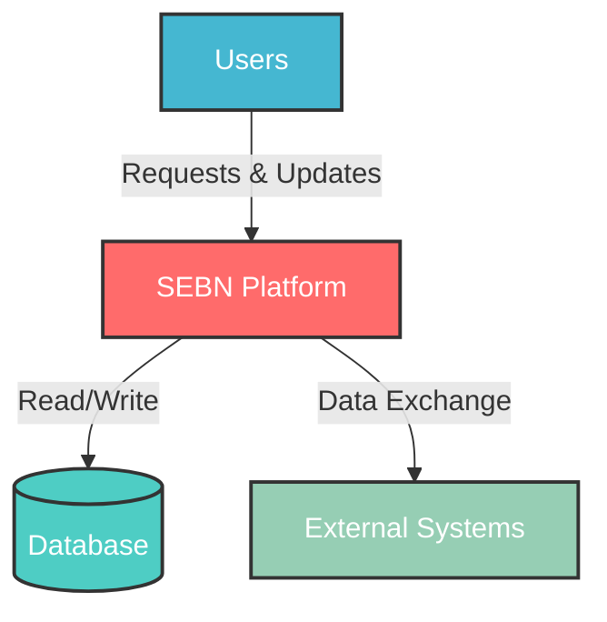
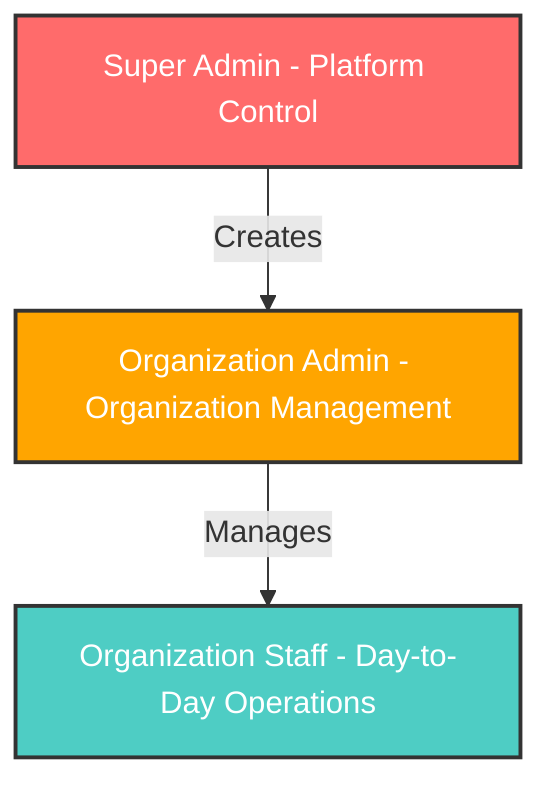
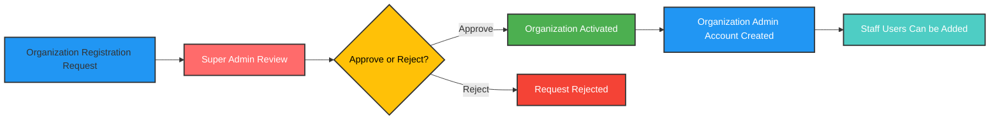
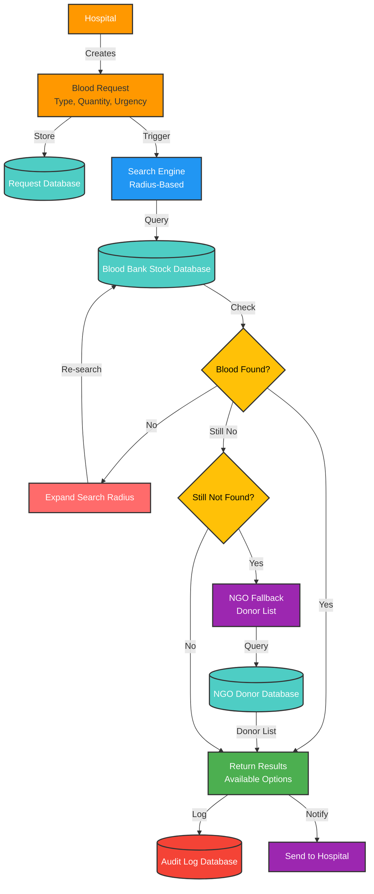
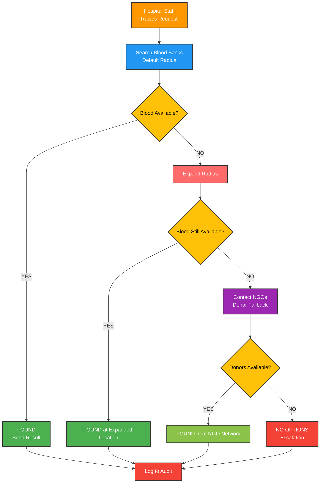
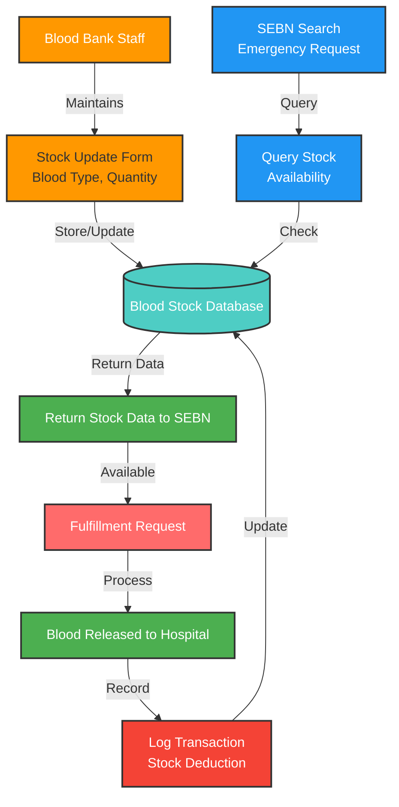
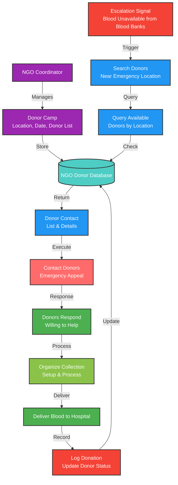
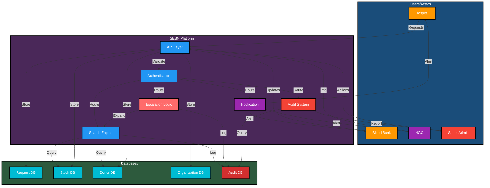
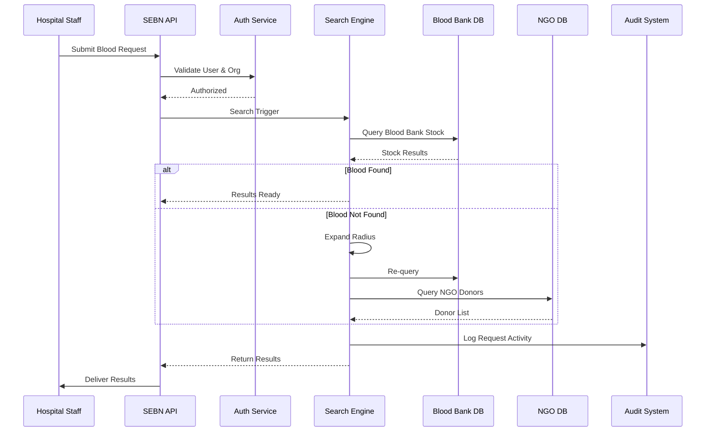

# System Flow: Smart Emergency Blood Network (SEBN)

This document describes the high-level system workflow of SEBN with comprehensive DFDs and flow diagrams.

---

## Overview: System Context Diagram (Level 0 DFD)

---

## 1. Authority & User Structure

SEBN follows a centralized governance model with organization-level autonomy.

### Role Levels

**Super Admin**
- Controls the SEBN platform
- Approves or rejects organization registrations
- Has audit and monitoring access across the system

**Organization Admin**
- Created automatically after organization approval
- Manages users and operations within a single organization

**Organization Staff**
- Operate under an organization admin
- Perform day-to-day actions (stock updates, request handling)

### Role Hierarchy Diagram

---

## 2. Organization Registration & Approval Flow

Before using the system, every organization must be approved.

### Detailed Registration Flow

---

## 3. Emergency Blood Request Flow (Core Process)

This is the most critical operational workflow of SEBN.

### Complete Emergency Request DFD

### Emergency Request Decision Tree

---

## 4. Blood Bank Operations Flow

Blood banks are the primary source of blood availability in the system.

### Blood Bank Data Flow Diagram

---

## 5. NGO Support & Donor Fallback Flow

NGOs provide secondary support through donor networks during critical blood shortages.

### NGO Donor Fallback DFD

---

## 6. Complete System Data Flow

---

## 7. Request Processing Sequence Diagram

---

## 8. Summary

SEBN uses a **sophisticated yet governed workflow** to coordinate blood availability:

### Key Features

- **Governed Access**: Super Admin controls all approvals  
- **Real-time Search**: Intelligent blood bank queries  
- **Automatic Escalation**: Progressive radius expansion  
- **NGO Fallback**: Secondary donor network activation  
- **Complete Audit Trail**: Every action logged  
- **Multi-stakeholder Coordination**: Hospital, Blood Bank, NGO, Admin  
- **Scalable Architecture**: Supports multiple organizations

### Core Workflow

1. **Request**: Hospital submits blood request
2. **Search**: System queries nearby blood banks
3. **Escalate**: If not found, expand radius
4. **Fallback**: If still unavailable, contact NGO donors
5. **Deliver**: Return results to hospital
6. **Audit**: Log all actions for compliance

The system balances **simplicity** with **sophistication**, ensuring efficient emergency blood distribution across a governed, multi-organization healthcare ecosystem.
