# ANALYTICS
## Smart Emergency Blood Network (SEBN)

This document presents a market and ecosystem analysis of SEBN, covering problem context, stakeholder pain points, existing systems, and system positioning.
The intent is to demonstrate problem relevance, awareness of existing solutions, and the specific coordination gap SEBN addresses, rather than feature comparison alone.

---

## 1. Market Context & Problem Relevance

Blood availability during medical emergencies remains a persistent operational challenge across healthcare systems.

While blood collection and storage infrastructure exists, timely coordination during emergencies is often inefficient.

### Emergency Blood Coordination Problem

```mermaid
graph TB
    Problem["🏥 Emergency Blood Request"]
    
    subgraph Manual["❌ CURRENT PROCESS (Manual)"]
        M1["1. Hospital calls<br/>multiple blood banks"]
        M2["2. Long delays<br/>& uncertainty"]
        M3["3. Limited fallback<br/>options"]
        M4["4. No escalation<br/>logic"]
    end
    
    subgraph SEBN_Process["✅ SEBN SOLUTION (Automated)"]
        S1["1. Digital request<br/>to system"]
        S2["2. Instant multi-source<br/>search"]
        S3["3. Auto escalation<br/>if needed"]
        S4["4. NGO fallback<br/>activated"]
    end
    
    Problem -->|Manual Route| Manual
    Problem -->|SEBN Route| SEBN_Process
    
    Manual -.->|Slow, Uncertain| Result["❌ Delayed Response"]
    SEBN_Process -->|Fast, Reliable| Result2["✅ Quick Resolution"]
    
    style Problem fill:#e65100,stroke:#bf360c,stroke-width:2px,color:#fff
    style Manual fill:#c62828,stroke:#b71c1c,stroke-width:2px,color:#fff
    style SEBN_Process fill:#388e3c,stroke:#1b5e20,stroke-width:2px,color:#fff
    style Result fill:#b71c1c,stroke:#8b0000,stroke-width:2px,color:#fff
    style Result2 fill:#2e7d32,stroke:#1b5e20,stroke-width:2px,color:#fff
```

Common real-world conditions include:

- Time-sensitive trauma and accident cases
- Rare blood group requirements
- Sudden spikes in demand
- Dependence on manual calls and informal coordination

The core problem is not only blood availability, but how quickly and reliably the right source is identified and coordinated during emergencies.

---

## 2. Stakeholder Pain Points

Different stakeholders face distinct operational challenges in the current fragmented ecosystem.

### Stakeholder Pain Points Comparison

```mermaid
graph LR
    subgraph Hospital["🏥 HOSPITALS"]
        H1["❌ Difficulty locating<br/>required blood quickly"]
        H2["❌ Manual coordination<br/>with multiple sources"]
        H3["❌ Limited fallback<br/>mechanism"]
        H4["❌ No escalation<br/>support"]
    end
    
    subgraph BB["🩸 BLOOD BANKS"]
        B1["❌ Reactive approach<br/>to requests"]
        B2["❌ Stock data not<br/>always optimized"]
        B3["❌ No escalation<br/>workflows"]
        B4["❌ Limited coordination<br/>visibility"]
    end
    
    subgraph NGO["🤝 NGOs & DONORS"]
        N1["❌ Manual donor<br/>coordination"]
        N2["❌ Fragmented<br/>donor networks"]
        N3["❌ No integration<br/>with hospitals"]
        N4["❌ Donor data<br/>underutilized"]
    end
    
    subgraph Admin["📊 ADMINISTRATORS"]
        A1["❌ Limited visibility<br/>into emergency delays"]
        A2["❌ No tracking of<br/>stalled cases"]
        A3["❌ Lack of consolidated<br/>insights"]
        A4["❌ No audit trail<br/>for analysis"]
    end
    
    style Hospital fill:#c62828,stroke:#b71c1c,stroke-width:2px,color:#fff
    style BB fill:#e65100,stroke:#bf360c,stroke-width:2px,color:#fff
    style NGO fill:#4a148c,stroke:#38006b,stroke-width:2px,color:#fff
    style Admin fill:#0d47a1,stroke:#051c7c,stroke-width:2px,color:#fff
```

---

## 3. Competitive Positioning & Market Analysis

### Existing Systems Landscape

```mermaid
graph TB
    subgraph SEBN["✅ SEBN - TARGETED SOLUTION"]
        S1["Emergency-First Design"]
        S2["Multi-Stakeholder<br/>Coordination"]
        S3["Progressive Escalation"]
        S4["Governed Integration"]
        S5["Audit & Analytics"]
    end
    
    subgraph eRaktKosh["eRaktKosh<br/>(Government)"]
        E1["Inventory Portal"]
        E2["Periodic Updates"]
        E3["Stock Visibility Only"]
        E4["Manual Coordination"]
    end
    
    subgraph Friends["Friends2Support<br/>(Donor Platform)"]
        F1["Donor Directory"]
        F2["Public Search"]
        F3["Manual Contact"]
        F4["Limited Governance"]
    end
    
    subgraph Regional["Regional Systems<br/>(Isolated)"]
        R1["Hospital-Specific"]
        R2["Limited Scope"]
        R3["No Integration"]
        R4["Ad-hoc Workflows"]
    end
    
    SEBN -->|Builds on but extends| eRaktKosh
    SEBN -->|Integrates with| Friends
    SEBN -->|Connects| Regional
    
    style SEBN fill:#388e3c,stroke:#1b5e20,stroke-width:3px,color:#fff
    style eRaktKosh fill:#e65100,stroke:#bf360c,stroke-width:2px,color:#fff
    style Friends fill:#4a148c,stroke:#38006b,stroke-width:2px,color:#fff
    style Regional fill:#c62828,stroke:#b71c1c,stroke-width:2px,color:#fff
```

### Key Differentiation Points

| Aspect | eRaktKosh | Friends2Support | Regional Systems | **SEBN** |
|--------|-----------|-----------------|------------------|---------|
| **Emergency Focus** | ❌ General | ❌ General | ❌ Ad-hoc | ✅ **Primary** |
| **Escalation Logic** | ❌ None | ❌ None | ❌ None | ✅ **Automated** |
| **Multi-Stakeholder** | Partial | Limited | Minimal | ✅ **Full** |
| **Hospital Integration** | Read-Only | Manual | Minimal | ✅ **Active** |
| **Governance & Audit** | Basic | Minimal | Minimal | ✅ **Comprehensive** |
| **Real-Time Response** | ❌ Delayed | ❌ Manual | ❌ Ad-hoc | ✅ **Instant** |

---

## 4. Market Gaps & SEBN Positioning

Across the current ecosystem, common gaps exist that block efficient emergency coordination:

### Identified Gaps vs. SEBN Solutions

```mermaid
graph LR
    subgraph Gaps["❌ IDENTIFIED GAPS"]
        G1["No emergency-first<br/>design"]
        G2["Absence of progressive<br/>escalation"]
        G3["Minimal integration<br/>across stakeholders"]
        G4["Limited governance<br/>& audit"]
        G5["No decision support<br/>for admins"]
    end
    
    subgraph SEBN_Soln["✅ SEBN SOLUTIONS"]
        S1["Emergency-optimized<br/>workflows"]
        S2["Smart escalation<br/>cascade"]
        S3["Unified coordination<br/>layer"]
        S4["Full audit trail<br/>& compliance"]
        S5["Analytics-driven<br/>insights"]
    end
    
    G1 -.->|Solved by| S1
    G2 -.->|Solved by| S2
    G3 -.->|Solved by| S3
    G4 -.->|Solved by| S4
    G5 -.->|Solved by| S5
    
    style Gaps fill:#c62828,stroke:#b71c1c,stroke-width:2px,color:#fff
    style SEBN_Soln fill:#388e3c,stroke:#1b5e20,stroke-width:2px,color:#fff
    style G1 fill:#ef5350,stroke:#d32f2f,stroke-width:1px,color:#fff
    style G2 fill:#ef5350,stroke:#d32f2f,stroke-width:1px,color:#fff
    style G3 fill:#ef5350,stroke:#d32f2f,stroke-width:1px,color:#fff
    style G4 fill:#ef5350,stroke:#d32f2f,stroke-width:1px,color:#fff
    style G5 fill:#ef5350,stroke:#d32f2f,stroke-width:1px,color:#fff
    style S1 fill:#66bb6a,stroke:#2e7d32,stroke-width:1px,color:#fff
    style S2 fill:#66bb6a,stroke:#2e7d32,stroke-width:1px,color:#fff
    style S3 fill:#66bb6a,stroke:#2e7d32,stroke-width:1px,color:#fff
    style S4 fill:#66bb6a,stroke:#2e7d32,stroke-width:1px,color:#fff
    style S5 fill:#66bb6a,stroke:#2e7d32,stroke-width:1px,color:#fff
```

These gaps represent the **unmet market need** that SEBN directly addresses.

---
- Emphasis on data visibility rather than decision support

These gaps are operational and coordination-centric, not purely technological.

---

## 5. SEBN Positioning & Design Rationale

SEBN is positioned as a governed coordination and decision-support layer.

**Key positioning principles:**

- Emergency-driven workflows instead of directory-based search
- Governed access rather than open or public listings
- Multi-stakeholder coordination instead of isolated views
- Audit-oriented system design for accountability and trust

### Important Clarification

SEBN does not aim to replace existing platforms such as eRaktKosh or donor registries.

Instead, SEBN is designed to complement existing systems by focusing on:

- How emergencies are handled
- How escalation occurs when blood is unavailable
- How administrators gain visibility into delays and failures

In this sense, SEBN acts as an organizational and coordination layer, not a replacement registry.

---

## 6. Market Fit & Adoption Considerations

SEBN aligns with real-world adoption constraints because:

It does not require blood banks or NGOs to change core operations

- It can operate alongside existing government and donor portals
- It introduces governance gradually rather than disruptively
- It prioritizes operational clarity over feature complexity

This approach reduces institutional resistance and improves feasibility.

---

## 7. Analytical Summary

From an analytical standpoint:

- The blood emergency problem is primarily coordination-centric
- Existing systems focus on visibility or listing, not escalation
- SEBN fills a structural gap in emergency handling
- The system is realistic, complementary, and deployable

SEBN's value lies in organizing interactions under defined rules, not in creating another standalone registry.

---

## 8. Conclusion

Market and ecosystem analysis indicates a clear need for a governed emergency blood coordination system.

By addressing:

- Emergency workflows
- Controlled escalation
- Administrative visibility
- Institutional feasibility

SEBN provides a practical, realistic, and institution-ready response to a persistent healthcare coordination challenge.