# Smart Emergency Blood Network (SEBN)

A governed digital network that connects hospitals, blood banks, and NGOs to enable fast, reliable, and auditable blood access during emergency and critical conditions.

## Problem Statement

During medical emergencies and rare blood group requirements, hospitals often struggle to locate blood in time. The current process relies heavily on manual phone calls, fragmented information, and informal coordination between hospitals, blood banks, and donor groups. This results in delays, uncertainty, and inefficiency during critical situations.

There is no unified, verified, and near real-time system that allows hospitals to discover available blood or eligible donors quickly and reliably.

### Limitations of Existing Systems

- Manual calling of multiple blood banks
- Limited or fragmented visibility of blood stock
- Poor coordination between hospitals, blood banks, and NGOs
- Lack of verified and governed access
- No structured fallback when blood is unavailable nearby
- Minimal auditability and accountability

## Core Idea

SEBN introduces a centrally governed emergency blood network where verified hospitals, blood banks, and NGOs operate on a single platform.

SEBN is designed as a decision-support and coordination system, not as a replacement for existing blood bank operations.

### System Workflow

1. **Hospital raises a blood requirement request** - Digitally submit emergency needs
2. **System searches nearby blood banks** - Using real-time stock data
3. **Search radius expands progressively** - If blood is unavailable
4. **NGOs are triggered as fallback** - To identify eligible donors
5. **Hospital receives confirmed availability** - With complete details
6. **Admin monitors and audits** - The complete request lifecycle

#### Emergency Request Processing Flow

```mermaid
flowchart TD
    H["🏥 Hospital<br/>Raises Request"]
    S["🔍 Search Nearby<br/>Blood Banks"]
    F1{"✓ Blood<br/>Found?"}
    R["📊 Return Results<br/>to Hospital"]
    E["📍 Expand Search<br/>Radius"]
    F2{"✓ Still Not<br/>Found?"}
    N["🤝 Contact NGO<br/>Donor Network"]
    F3{"✓ Donors<br/>Available?"}
    E2["❌ No Options<br/>Escalate Alert"]
    L["📋 Log to<br/>Audit Trail"]
    
    H --> S
    S --> F1
    F1 -->|YES| R
    F1 -->|NO| E
    E --> F2
    F2 -->|YES| R
    F2 -->|NO| N
    N --> F3
    F3 -->|YES| R
    F3 -->|NO| E2
    
    R --> L
    E2 --> L
    
    style H fill:#ff9800,stroke:#e65100,stroke-width:2px,color:#fff
    style S fill:#1976d2,stroke:#0d47a1,stroke-width:2px,color:#fff
    style F1 fill:#f57f17,stroke:#e65100,stroke-width:2px,color:#fff
    style F2 fill:#f57f17,stroke:#e65100,stroke-width:2px,color:#fff
    style F3 fill:#f57f17,stroke:#e65100,stroke-width:2px,color:#fff
    style E fill:#d32f2f,stroke:#b71c1c,stroke-width:2px,color:#fff
    style E2 fill:#c62828,stroke:#b71c1c,stroke-width:2px,color:#fff
    style N fill:#7b1fa2,stroke:#4a148c,stroke-width:2px,color:#fff
    style R fill:#388e3c,stroke:#1b5e20,stroke-width:2px,color:#fff
    style L fill:#455a64,stroke:#263238,stroke-width:2px,color:#fff
```

(Detailed flows and DFDs are documented separately.)

## Key Differentiators (USP)

### Problem vs Solution Visualization

**Key Differentiators (USP)**:

-  Real-time blood stock visibility across verified blood banks
-  Single portal for blood bank discovery and donor identification
-  Progressive radius-based emergency search
-  NGO-backed donor fallback mechanism for rare or unavailable blood
-  Admin-governed trust model (verification, rules, audit logs)
-  Emergency-first system design, not a generic inventory app

## Stakeholders & Roles

### Stakeholder Interaction Model

```mermaid
graph TB
    Admin["👨‍💼 Super Admin<br/>Platform Control"]
    Hospital["🏥 Hospital<br/>Emergency Requests"]
    BloodBank["🩸 Blood Bank<br/>Stock Provider"]
    NGO["🤝 NGO<br/>Donor Network"]
    
    Admin -->|Approves| Hospital
    Admin -->|Approves| BloodBank
    Admin -->|Approves| NGO
    Admin -->|Monitors| Hospital
    Admin -->|Monitors| BloodBank
    Admin -->|Monitors| NGO
    
    Hospital -->|Searches| BloodBank
    Hospital -->|Escalates to| NGO
    
    BloodBank -->|Updates Stock| BloodBank
    NGO -->|Organizes Camps| NGO
    
    style Admin fill:#c62828,stroke:#b71c1c,stroke-width:2px,color:#fff
    style Hospital fill:#e65100,stroke:#bf360c,stroke-width:2px,color:#fff
    style BloodBank fill:#0d47a1,stroke:#051c7c,stroke-width:2px,color:#fff
    style NGO fill:#4a148c,stroke:#38006b,stroke-width:2px,color:#fff
```

### Hospitals
- Raise blood emergency requests
- View available blood and donor options
- Do not manually contact blood banks

### Blood Banks
- Maintain and update blood stock regularly
- Act as the primary blood source
- Operate only after admin verification

### NGOs
- Organize blood donation camps
- Maintain active donor data
- Act as fallback donor providers during shortages

### Admin
- Verify hospitals, blood banks, and NGOs
- Define system rules and escalation logic
- Monitor activity and maintain audit logs
- Ensure data reliability and system integrity

## Technology Stack

### System Architecture Overview

**Technology Stack:**

### Frontend
- React (mobile-first design)

### Backend
- Node.js
- Express.js

### Database
- MongoDB (native driver)

## Core Concepts

- Role-based access control
- Location-based search
- Rule-driven emergency handling
- Audit-oriented system design

## Documentation Structure

This repository includes multiple focused documentation files. **Click on any file below to view its contents:**

- [📊 **SYSTEM_FLOW.md**](Main%20Documentation/SYSTEM_FLOW.md) – Detailed flow charts and DFDs
- [🏗️ **ARCHITECTURE.md**](Main%20Documentation/Architecture.md) – Backend architecture and module design
- [🗄️ **DATA_MODEL.md**](Main%20Documentation/DATA_MODEL.md) – Database schemas and relationships
- [🚀 **ROUND2_ROADMAP.md**](Main%20Documentation/ROUND2_ROADMAP.md) – Planned improvements and feature expansion
- [📈 **COMPETITIVE_ANALYSIS.md**](Main%20Documentation/Analyticscopy.md) – Positioning against existing platforms

## Current Status (Round 1)

- System design finalized
- Stakeholder roles clearly defined
- Emergency handling logic documented
- Governance and admin control model established

Round 1 focuses on validating the system design, workflows, and technical feasibility.

## Scope Clarification

SEBN currently focuses exclusively on blood emergency management. The architecture is intentionally designed to support future expansion to other emergency resources, but such extensions are planned for later stages.

## Conclusion

SEBN aims to replace fragmented and manual blood search processes with a trusted, automated, and scalable emergency blood network, enabling faster response times and better coordination during critical medical situations.
v
## LINKS
1) DEMO LINK - https://youtu.be/iH7X0AfZn-8
2) Postman Documentations Admin - https://documenter.getpostman.com/view/39216723/2sBXVbJuPe
3) Postman Documentation of Hospital - https://documenter.getpostman.com/view/39215245/2sBXVbJuTv
